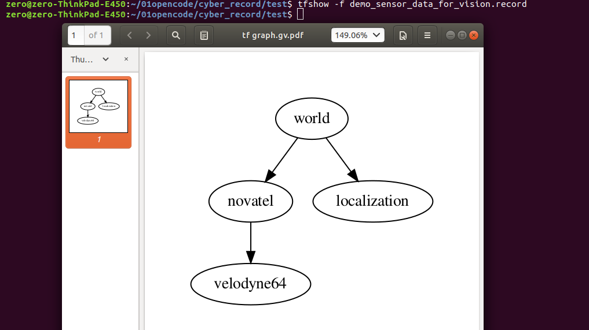

# tfshow
cyber tf visualizer.

## Install
tfshow need graphviz, so you should install graphviz first.
```shell
sudo apt-get install graphviz

pip install tfshow
```

## Quick start
After install tfshow, you can use below cmd to visualize coordinate transformation.
```shell
tfshow -f demo.record
```

then you can see the result

